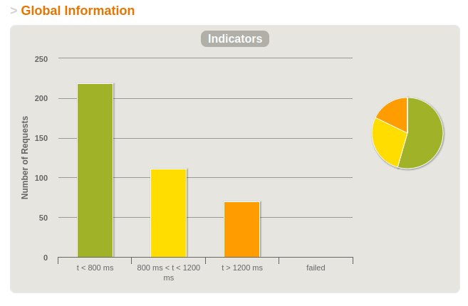
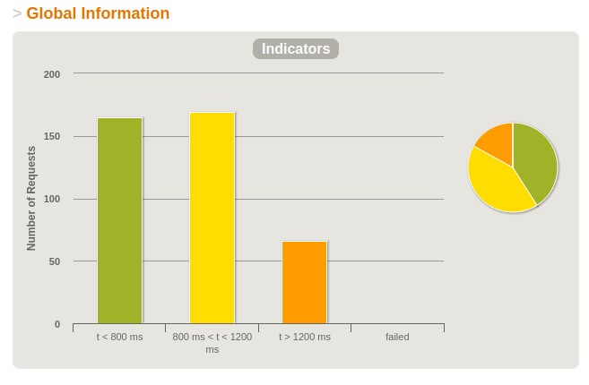

# Gatling Loading Tests

The following scenarios test if the web application can handle higher user numbers and database accesses.

For the Tests I generated a random dataset. We want dynamic data so that all users don't play the same and we end up with a behavior completely different from the live system (caching, JIT...)

### 1. LoadTest
        tests if 100 users can load, write and remove data simultaneosly 
        -> was able to handle all 400 requests in 9seconds (50% in t<800ms)

### 2. EnduranceTest
        tests if 10 users can repeatedly (100x) load, write and remove data
        -> was able to handle all 4000 requests in 9 minutes in t<800ms

### 3. StressTest
        tests if the application can handle an increase of users per second, up to 100, for at least 1 minute.
        -> was able to handle all 12240 requests in 3 minutes in t<1200ms

### 4. SpikeTest
        tests if 3000 active users can access the database at once.
        -> was able to handle 11603 of 12000 request in 3 minutes. 11% of the /add-item requests and 3% of the /remove-item requests failed, so there might be room for improvement.

The tests were executed locally. Thus, the above statements are only valid for the performance of the web application itself. Depending on which hosting platform is used, the throughput deteriorates.

Detailed results can be viewed in the /results folder.

## Comparison of Loadtest Performance

### Localhost

### Heroku

