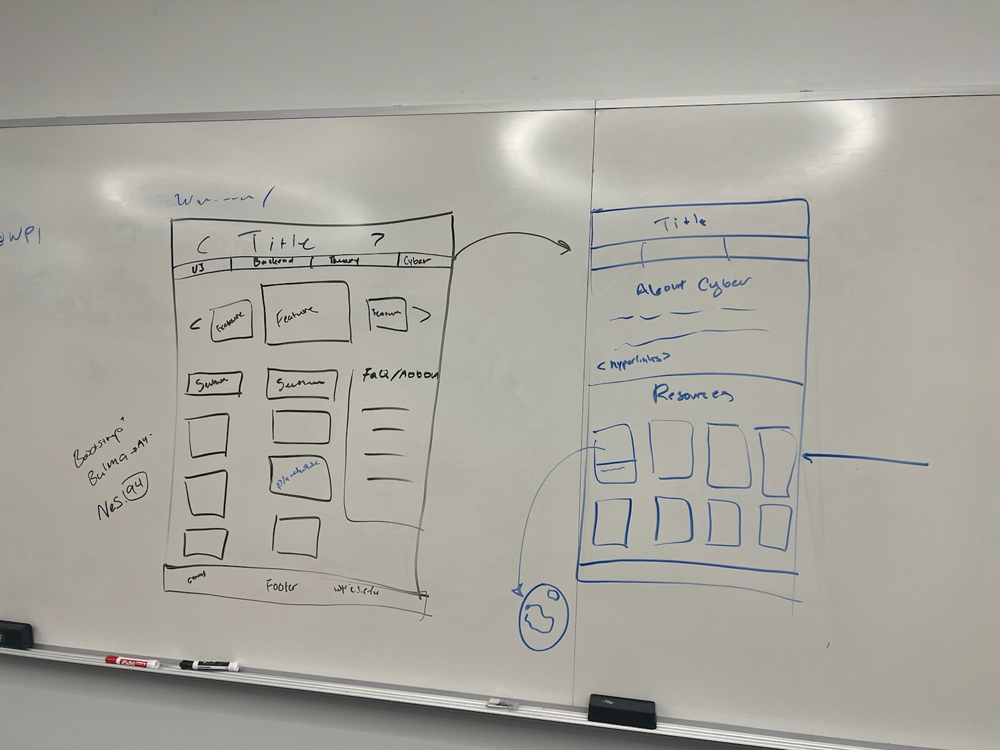

# How to Survive CS@WPI

### Hailey Anderson

### Chayanne Sandoval-Williams

---

## Project Description: 
How to Survive CS@WPI is going to be a hub for CS resources that are specifically tailored by WPI students for WPI students.
It will feature different cards full of information crowdsourced from WPI students in a variety of backgrounds. The hope is to create a dyamic set of resources that can be added to and accessed for the future.\

We are bouncing between a few ideas for CSS frameworks, looking at maybe Bootstrap or Bulma for something sleek or Nes.CSS or 98.CSS for something a little kitcshy and camp.
Included here is a very rough sketch of what the UI framework may end up looking like:\
\
Each resource is a card based hyperlink that shows more info when hovered over.
\
\
On the back end, we will be using Svelte to handle the dyanmic behavior of the website. It will work between the HTML and the server to make sure that everything is done. Svelte will combine the calls made to the server as well as the information used by the website to ensure User notes are passed along through proper channels. Additionally JSX will be used to add and control flow.