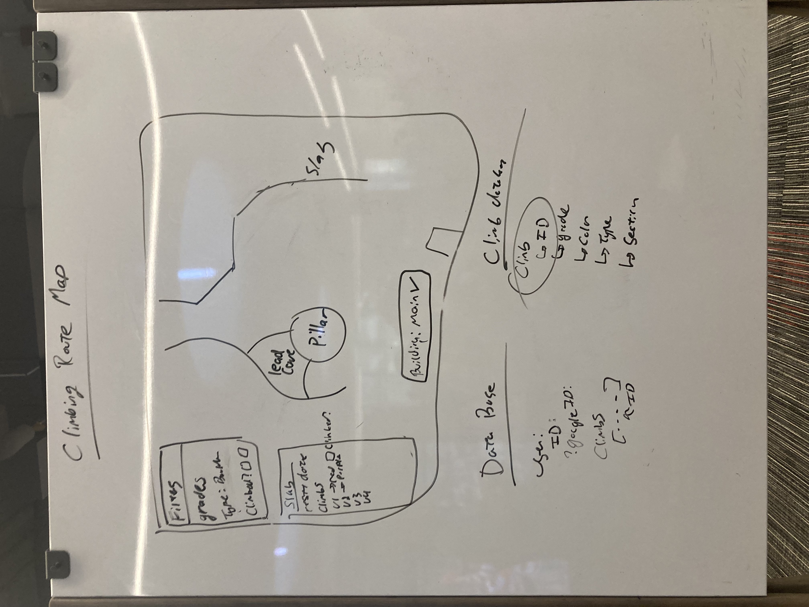

# CS 4241 Project Proposal
### Travis Thompson, Colby Frechette
### Climbing Gym Map

For the final assignment in CS 4241, we will create an interactive climbing gym map. The page will allow users to filter the gym for specific climbing grades, highlighting them on the map of the gym. Additionally it will allow the user to track which climbs they have finished.

For the admin page, each field for a climb will be available to enter, including Grade, Type, Section, and Color. Admins for the webpage can enter each of the items and click Add to add the climb to the main database. On the right of the admin page, a full list of climbs will be displayed with a remove button next to each, allowing the admin to remove the climbs as they get reset in the gym.

The server will be able to have the user login with google authentication. Additionally we will store route data and climber data in MongoDB. Users will have the option to select a climb as completed, and when a user is logged in, they can filter the climbs they have completed.

Technologies:
Node.js
Express
MongoDB
D3
Google Auth
React - TBD
CSS Framework - TBD
